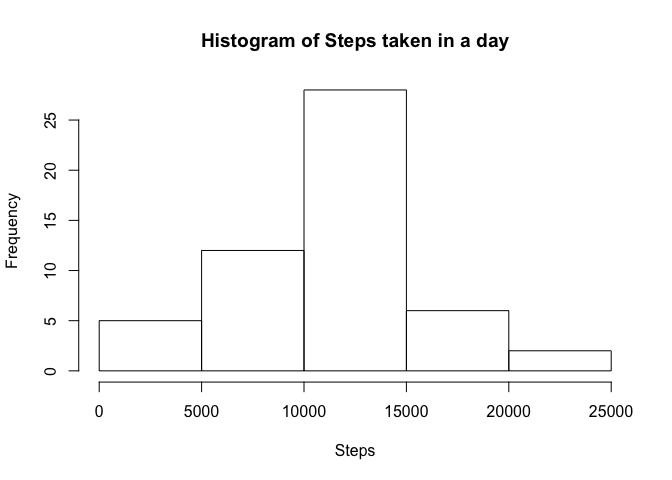
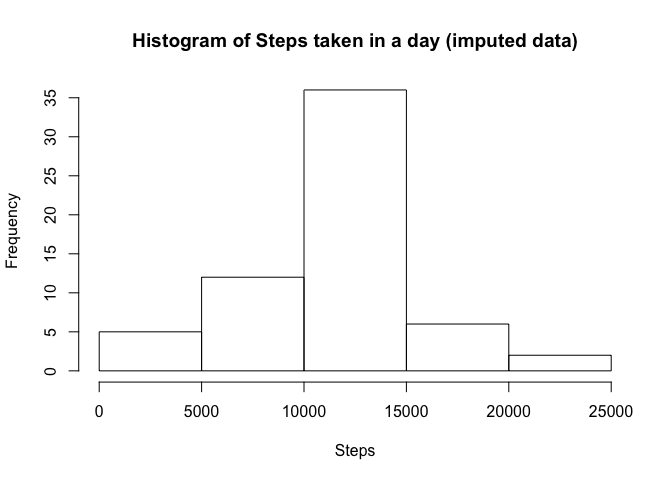
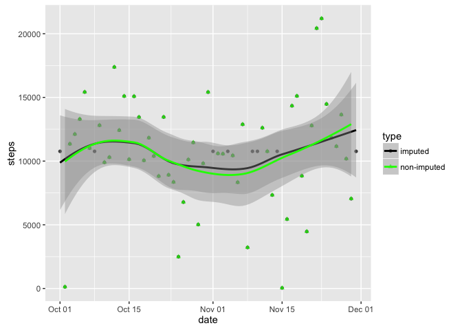
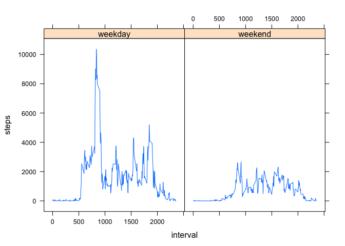

# Reproducible Research: Peer Assessment 1


## Loading and preprocessing the data
Unzip the "activity.zip" file and load the data into a "rawData" object. Preview the structure of loaded data.


```r
unzip("activity.zip")
rawData <- read.csv("activity.csv", header=TRUE)
str(rawData)
```

```
## 'data.frame':	17568 obs. of  3 variables:
##  $ steps   : int  NA NA NA NA NA NA NA NA NA NA ...
##  $ date    : Factor w/ 61 levels "2012-10-01","2012-10-02",..: 1 1 1 1 1 1 1 1 1 1 ...
##  $ interval: int  0 5 10 15 20 25 30 35 40 45 ...
```

Convert the "date" column in data.frame to Date object. Also, prepare a new object "stepsData", which has all the records where steps is present.


```r
rawData$date<- as.Date(as.character(rawData$date), "%Y-%m-%d")
stepsData <- subset(rawData, !is.na(steps))
head(stepsData)
```

```
##     steps       date interval
## 289     0 2012-10-02        0
## 290     0 2012-10-02        5
## 291     0 2012-10-02       10
## 292     0 2012-10-02       15
## 293     0 2012-10-02       20
## 294     0 2012-10-02       25
```

## What is mean total number of steps taken per day?

Aggregate steps by grouping the values over date.

```r
stepsSummary <- aggregate(steps ~ date, stepsData, sum)
head(stepsSummary)
```

```
##         date steps
## 1 2012-10-02   126
## 2 2012-10-03 11352
## 3 2012-10-04 12116
## 4 2012-10-05 13294
## 5 2012-10-06 15420
## 6 2012-10-07 11015
```

Plot the histogram

```r
hist(stepsSummary$steps, xlab = "Steps", main = "Histogram of Steps taken in a day")
```

<!-- -->

Find out the mean/median (and Quartiles..) of number of steps taken per day

```r
summary(stepsSummary$steps)
```

```
##    Min. 1st Qu.  Median    Mean 3rd Qu.    Max. 
##      41    8841   10760   10770   13290   21190
```


## What is the average daily activity pattern?

Find the "mean" of steps aggregated over interval.


```r
summaryByInterval <- aggregate(steps ~ interval, stepsData, mean)
head(summaryByInterval)
```

```
##   interval     steps
## 1        0 1.7169811
## 2        5 0.3396226
## 3       10 0.1320755
## 4       15 0.1509434
## 5       20 0.0754717
## 6       25 2.0943396
```

Plot the timeseries of average steps taken by interval.


```r
with(summaryByInterval, plot(steps ~ interval, type = "l"))
```

<!-- -->

Order the summaryByInterval data.frame by steps (in decreasing order), and print the interval with maximum average number of steps (which is in the first row of ordered data.frame).


```r
orderedSummary <- summaryByInterval[order(summaryByInterval$steps, decreasing = TRUE), ]
orderedSummary[1,1]
```

```
## [1] 835
```


## Imputing missing values
Find rows in rawData, with missing values. Print out the count of invalid rows.


```r
invalidRows <- subset(rawData, is.na(steps))
nrow(invalidRows)
```

```
## [1] 2304
```

Let's use summaryByInterval and use average steps by interval to impute the missing values in the invalid Rows. Also convert the "steps" column data type to numeric, as the average is not integer and by default the "steps" column is of type integer. 


```r
invalidRows$steps <- as.numeric(invalidRows$steps)
mergedData <- merge(x = invalidRows, y = summaryByInterval, by = "interval", all.x = TRUE)
str(mergedData)
```

```
## 'data.frame':	2304 obs. of  4 variables:
##  $ interval: int  0 0 0 0 0 0 0 0 5 5 ...
##  $ steps.x : num  NA NA NA NA NA NA NA NA NA NA ...
##  $ date    : Date, format: "2012-10-01" "2012-11-30" ...
##  $ steps.y : num  1.72 1.72 1.72 1.72 1.72 ...
```

Now select the relevant columns and convert the mergedData to same structure as the stepsData, which has all the valid records. While we are at it, convert the "steps" column in stepsData as numeric as well, so that we can later merge the imputed data with stepsData.


```r
imputedData <- mergedData[, c(4,3,1)]
names(imputedData) <- names(stepsData)
imputedData$date<- as.Date(as.character(imputedData$date), "%Y-%m-%d")
stepsData$steps <- as.numeric(stepsData$steps)
str(imputedData)
```

```
## 'data.frame':	2304 obs. of  3 variables:
##  $ steps   : num  1.72 1.72 1.72 1.72 1.72 ...
##  $ date    : Date, format: "2012-10-01" "2012-11-30" ...
##  $ interval: int  0 0 0 0 0 0 0 0 5 5 ...
```

We are now in a position to merge the rows from valid steps data and imputed steps data. After merging the rows sort the results by Date/Interval


```r
fullImputedData <- rbind(stepsData, imputedData)
fullImputedData <- fullImputedData[order(fullImputedData$date, fullImputedData$interval), ]
str(fullImputedData)
```

```
## 'data.frame':	17568 obs. of  3 variables:
##  $ steps   : num  1.717 0.3396 0.1321 0.1509 0.0755 ...
##  $ date    : Date, format: "2012-10-01" "2012-10-01" ...
##  $ interval: int  0 5 10 15 20 25 30 35 40 45 ...
```

Prepare a summary of the fullImputedData and plot a histogram


```r
summaryFull <- aggregate(steps ~ date, fullImputedData, sum)
hist(summaryFull$steps, xlab = "Steps", main = "Histogram of Steps taken in a day (imputed data)")
```

<!-- -->

Print summary of the steps taken with new data set. This shows the median and mean are almost  similar to what is was before imputing.

```r
summary(summaryFull$steps)
```

```
##    Min. 1st Qu.  Median    Mean 3rd Qu.    Max. 
##      41    9819   10770   10770   12810   21190
```

```r
summary(stepsSummary$steps)
```

```
##    Min. 1st Qu.  Median    Mean 3rd Qu.    Max. 
##      41    8841   10760   10770   13290   21190
```

Lets prepare a data.frame with non-inputed and imputed data set together, such that we can plot them together for comparison purposes.

```r
summaryFull$type <- "imputed"
stepsSummary$type <- "non-imputed"

mergedDataset <- rbind(summaryFull, stepsSummary)
mergedDataset$type <- as.factor(mergedDataset$type)
library(ggplot2)
gg <- ggplot(mergedDataset, aes(x = date, y = steps, color = type)) 
gg <- gg + geom_point(aes(shape=type, color=type), alpha = 0.75)  
gg <- gg + geom_smooth() + scale_shape_manual(values = c(16, 17)) 
gg <- gg + scale_size_manual(values=c(15,2)) 
gg <- gg + scale_color_manual(values = c("black", "green"))
gg
```

<!-- -->


## Are there differences in activity patterns between weekdays and weekends?

Fill in a new "weekday" column in summaryFull, which represents day of the week.


```r
fullImputedData$weekday <- weekdays(fullImputedData$date)
fullImputedData$weekdayType <- "weekday"
fullImputedData[fullImputedData$weekday %in% c("Saturday", "Sunday"), ]$weekdayType <- "weekend"
fullImputedData$weekdayType <- as.factor(fullImputedData$weekdayType)
str(fullImputedData)
```

```
## 'data.frame':	17568 obs. of  5 variables:
##  $ steps      : num  1.717 0.3396 0.1321 0.1509 0.0755 ...
##  $ date       : Date, format: "2012-10-01" "2012-10-01" ...
##  $ interval   : int  0 5 10 15 20 25 30 35 40 45 ...
##  $ weekday    : chr  "Monday" "Monday" "Monday" "Monday" ...
##  $ weekdayType: Factor w/ 2 levels "weekday","weekend": 1 1 1 1 1 1 1 1 1 1 ...
```

Summarize data over interval and weekdayType and draw a pnel plot. We can see in the plot that people walk more during weekday vs weekend and especially during morning and evening hours.


```r
summaryFullByInterval <- aggregate(steps ~ interval+weekdayType, fullImputedData, sum)
library(lattice)
xyplot(steps~interval|weekdayType, data = summaryFullByInterval, type="l")
```

<!-- -->
